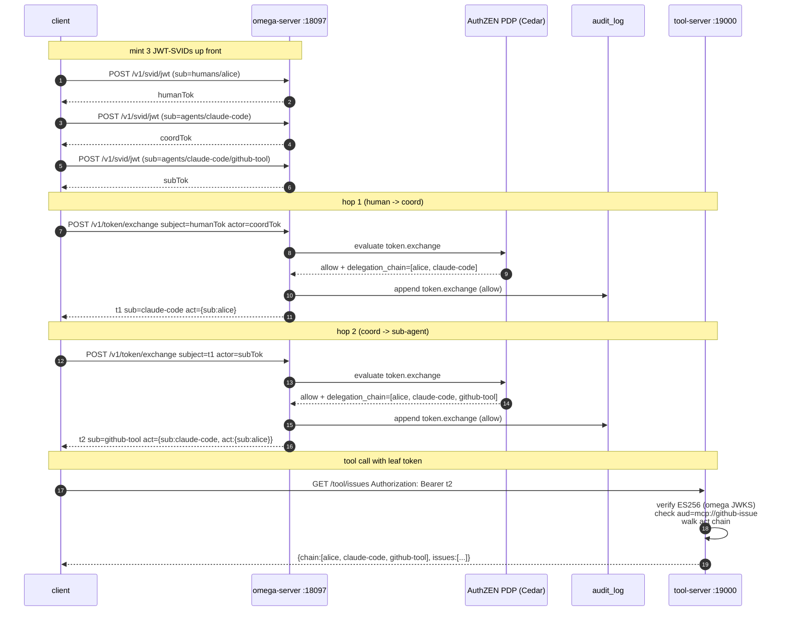

# MCP / A2A delegation chain (human → agent → sub-agent → tool)

End-to-end demonstration of the Omega delegation surface used by AI
agents: a human principal mints an identity, a coordinator agent
exchanges that for a delegated JWT-SVID, the coordinator hands off to
a sub-agent that performs the actual tool call, and the tool-server
verifies the leaf token while still seeing the full chain back to the
human. Every hop is gated by a Cedar policy evaluated through the
AuthZEN PDP.

## Wire diagram



The control plane runs with `--enforce-token-exchange-policy`, so the
Cedar policy in [`policies/`](policies/) has the final say on every
exchange - Cedar default-deny means a missing or non-matching policy
returns 403 (and writes a deny audit row).

## Run it

```bash
make demo
```

The script builds `omega`, the tool-server, and the client, then:

1. starts `omega server` on `127.0.0.1:18097` with the policy gate enabled,
2. starts the tool-server on `127.0.0.1:19000` (verifies tokens against
   `/v1/jwt/bundle`, expects audience `mcp://github-issue`),
3. runs the client orchestrator,
4. asserts the tool-server echoed the expected three-element chain,
5. asserts the audit log contains exactly two `token.exchange` allow
   rows rooted at the human SPIFFE ID,
6. as a negative case, runs a service-only exchange and asserts the
   policy returns 403.

Expected tail:

```text
[demo] running client (alice -> claude-code -> github-tool -> tool-server)
[client] minted human JWT-SVID  sub=spiffe://omega.local/humans/alice
[client] minted coord JWT-SVID  sub=spiffe://omega.local/agents/claude-code
[client] minted sub   JWT-SVID  sub=spiffe://omega.local/agents/claude-code/github-tool
[client] hop 1: chain=[.../humans/alice .../agents/claude-code]
[client] hop 2: chain=[.../humans/alice .../agents/claude-code .../agents/claude-code/github-tool]
[result] tool-server echoed:
{"caller_spiffe_id":".../agents/claude-code/github-tool",
 "delegation_chain":[".../humans/alice",".../agents/claude-code",".../agents/claude-code/github-tool"],
 "issues":[{"id":42,"title":"demo issue (echoed by tool-server)"}],
 "ok":true}

[demo] verifying the tool-server saw the full delegation chain
[demo] verifying the audit log has 2 token.exchange allow rows rooted at alice
[demo] running negative case (service-only chain, no human root) -> expect 403
[demo] success - 2-hop delegation reached the tool, policy gated the impostor
```

## The Cedar policy

[`policies/token-exchange.cedar`](policies/token-exchange.cedar) gates
every exchange on three things, all of which must hold:

```cedar
@id("allow-ai-acting-for-human")
permit (
  principal is Spiffe,
  action == Action::"token.exchange",
  resource is Spiffe
) when {
  principal has kind &&
  principal.kind == "ai" &&
  context.delegation_depth <= 2 &&
  principal.delegation_chain.contains("spiffe://omega.local/humans/alice")
};
```

The attributes Cedar reads here are seeded by the token-exchange
handler from each request:

| Cedar reference              | What the handler puts there                                        |
| ---------------------------- | ------------------------------------------------------------------ |
| `principal.kind`             | `ai` for `/agents/...`, `human` for `/humans/...`, else `service`  |
| `principal.delegation_chain` | flattened root → leaf list of subjects (set, supports `.contains`) |
| `principal.acting_for`       | the chain root (= the original human or service)                   |
| `context.delegation_depth`   | number of `act` nesting levels (1 for hop 1, 2 for hop 2)          |
| `context.requested_audience` | the `audience` array in the request body                           |

The sample policy is intentionally narrow (it pins on alice's exact
SPIFFE ID) so the demo's negative case lands in default-deny without
any extra ceremony. Real deployments express the same shape as
`principal.acting_for like "spiffe://.../humans/*"` once an attestor
or directory is wired in.

## What gets issued

The client mints three plain JWT-SVIDs up front, then walks two
exchanges:

| Step | API                               | Subject token | Actor token | Output `sub`           | Output `act`                                   |
| ---- | --------------------------------- | ------------- | ----------- | ---------------------- | ---------------------------------------------- |
| 1    | `POST /v1/svid/jwt`               | n/a           | n/a         | `humans/alice`         | n/a                                            |
| 2    | `POST /v1/svid/jwt`               | n/a           | n/a         | `agents/claude-code`   | n/a                                            |
| 3    | `POST /v1/svid/jwt`               | n/a           | n/a         | `.../github-tool`      | n/a                                            |
| 4    | `POST /v1/token/exchange` (hop 1) | alice         | claude-code | `agents/claude-code`   | `{sub: humans/alice}`                          |
| 5    | `POST /v1/token/exchange` (hop 2) | hop-1 token   | github-tool | `.../github-tool`      | `{sub: claude-code, act: {sub: humans/alice}}` |
| 6    | `GET /tool/issues`                | n/a           | n/a         | (Bearer = hop-2 token) | (tool-server walks act chain)                  |

Steps 1–3 are stand-ins for whatever produces the up-front identities
in production: an OIDC IdP for the human (Keycloak, Okta), the
SPIFFE Workload API for the coordinator and sub-agent. The
exchange shape (steps 4–5) and the verification on the tool side
(step 6) are unchanged.

## Tear down

```bash
make down
```

Removes the temp data directory, kills both the omega server and the
tool-server. Idempotent.

## Files

| Path                            | Purpose                                                                                 |
| ------------------------------- | --------------------------------------------------------------------------------------- |
| `policies/token-exchange.cedar` | the Cedar policy that gates `Action::"token.exchange"`                                  |
| `tool-server/main.go`           | echo MCP server: verifies ES256 JWT-SVIDs against Omega's JWKS and prints the act chain |
| `client/main.go`                | orchestrator: mints 3 SVIDs, runs 2 exchanges, calls the tool with the leaf token       |
| `run-demo.sh`                   | end-to-end script with positive and negative assertions                                 |
| `Makefile`                      | `make demo` / `make down` wrappers                                                      |
